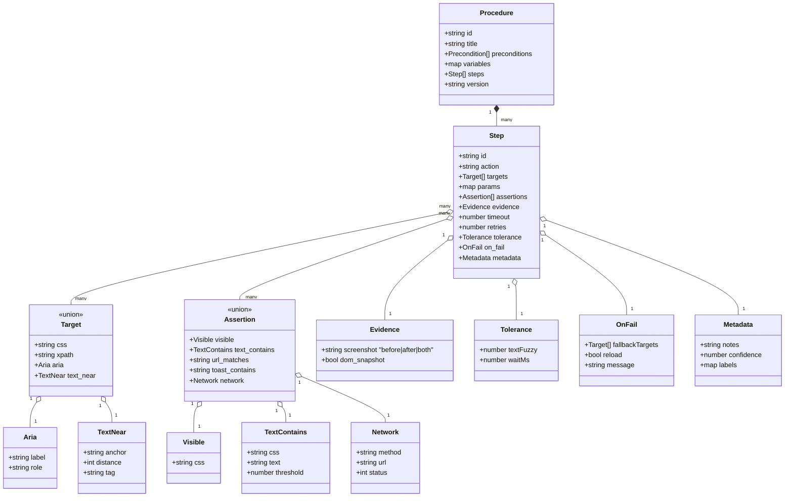

いいね、その発想めっちゃ現実的！
「手順書を“機械が読める作業計画”に落とし込む → ブラウザ上の実行状況と突き合わせて検証する」という流れで設計するとスムーズです。以下、実装しやすい順でロードマップと具体案をまとめます。

# 1) まずは「手順スキーマ」を決める

最低限ほしい項目は次の通り（AIで自動化しても、最終的にこの形に正規化するのがポイント）。

* `id` / `title` / `description`
* `preconditions`: 着手前に満たすべき状態（URL、ログイン状態、ロール、日付条件など）
* `steps[]`:

  * `action`: `"click" | "type" | "select" | "upload" | "navigate" | "wait" | "custom"`
  * `targets[]`: セレクタ集合（CSS/XPath/アクセシビリティ/テキスト近傍/画像類似など複数表現）
  * `params`: 入力値・選択値（変数参照可：`${ticket_id}`）
  * `assertions[]`: 画面状態の検証（要素存在、テキスト一致、ARIALive、ネットワークレスポンス、URL、コンソールエラーなし等）
  * `evidence`: スクショ・DOMスナップショット・ネットワークログの保存要否
  * `tolerance`: 許容ゆらぎ（文字類似度しきい値、待機時間、再試行回数）
  * `timeout` / `retries`
  * `on_fail`: フォールバック（代替ターゲット、リロード、ヒント表示）
  * `metadata`: ラベル、担当ロール、SLA、変更履歴
* `variables`: 実行時に埋める値（例：日付、チケット番号）
* `version` / `signing`: 手順の改ざん検知・配布管理用

### 例（YAML）

```yaml
id: "reset-cache-001"
title: "キャッシュクリア実施"
preconditions:
  - url_matches: "^https://admin.example.com/dashboard"
  - role: "operator"
variables:
  ticket_id: "JIRA-1234"
steps:
  - id: "open-settings"
    action: "click"
    targets:
      - css: "button#settings"
      - role: { name: "設定", type: "button" }
    assertions:
      - visible: { css: "div.settings-panel" }
    evidence: { screenshot: "after" }

  - id: "clear-cache"
    action: "click"
    targets:
      - text_near: { anchor: "キャッシュ", distance: 2, tag: "button" }
      - css: "button[data-action='clear-cache']"
    assertions:
      - toast_contains: "正常にクリア"
      - network: { method: "POST", url: "/api/cache/clear", status: 200 }
    timeout: 15000
    retries: 2
    evidence: { screenshot: "both", dom_snapshot: true }

  - id: "note-ticket"
    action: "type"
    targets:
      - aria: { label: "備考" }
    params:
      text: "対応: ${ticket_id}"
    assertions:
      - value_contains: "${ticket_id}"
version: "1.2.0"
signing:
  algo: "ed25519"
  signature: "…"
```

# 2) セレクタは「複数の識別子＋信頼度」で持つ

DOMは変わります。単一CSSに依存せず、**候補セット＋重み付け**で頑丈に。

* CSS / XPath（精密・壊れやすい）
* ARIAロール＋名前（アクセシビリティ強い）
* テキスト近傍（`text_near`）：アンカー語から距離Nのボタン等
* 視覚特徴（画像テンプレ/アイコン類似。必要ならオプション）
* “意味”類似（要素ラベル埋め込みベクトルで近いもの）

実行時は

1. 決定論的セレクタ（CSS/ARIA）→ 2) テキスト近傍 → 3) 意味類似
   の順で解決し、どれで選んだかを記録（監査に効く）。

# 3) AIで手順書→構造化：変換パイプライン

自由記述のSOPをAIで分解→上記スキーマへ正規化します。**完全自動より「半自動＋レビューワ」がおすすめ**。

1. **前処理**：PDF/Doc/Notionをテキスト化、見出し・箇条書き抽出、UI語彙辞書（例：「設定」「保存」「適用」）でセクション推定。
2. **抽出（LLM）**：

   * Few-shotで「手順抽出タスク」プロンプト（見出し→ステップ、命令文→action/targets/params、注意書き→assertions/tolerance）。
   * UIスクリーンショットがあるなら**要素ラベル抽出**も併用（OCR or アクセシビリティツリー）。
3. **ポストプロセス**：

   * 変数候補（日時・ID）を `${var}` に置換。
   * セレクタは「CSS試案＋テキスト近傍＋ARIA名」を生成。
   * ルールエンジンで抜け漏れ検査（全ステップに `assertions` があるか 等）。
4. **検証**：サンドボックスで**ドライラン**し、解決率が低いセレクタをハイライト。人がGUIで修正。
5. **署名＆バージョン**：公開前に署名し、拡張が受け取る。

### 抽出プロンプトの骨子（要点）

* 出力は**厳格JSON**・上記スキーマ。
* 命令文→`action`マッピング表（例：「クリック」「押下」= `click`）。
* 画面状態語彙→`assertions`（「トースト表示」「〇〇に遷移」）。
* UI名→`targets`（ARIA名/ラベル/テキスト近傍）。
* 曖昧な箇所は `confidence` を下げ、`notes` に根拠を書く（後レビュー用）。

# 4) 拡張の実行エンジン設計（Content Script + Policy Engine）

* **観測**：`click`/`input`/`change`/`submit`/`navigation`/`fetch` をフック。Shadow DOM/iframe対応（許可と同一オリジン対策）。
* **マッチング**：現在の「期待ステップ」と実際の操作を突き合わせ。

  * 期待と一致 → 次ステップへ。
  * 逸脱 → そのまま許容/要注意/ブロックをポリシーで選択。
* **検証**：`assertions` 実行（DOM・URL・ネットワーク・コンソールエラー）。
* **証跡**：スクショ（機微領域はマスキング）、DOMスナップショット、HTTPログ、時刻、操作者ID、セレクタ解決経路。
* **UI**：サイドパネルに

  * 現在のステップ／残タスク
  * セレクタ信頼度バー
  * 逸脱時の**安全なフォールバック**（代替ターゲット候補）
  * 「この画面では“保存”が見つかりません → 近いのは“適用”です。置換しますか？」のような提案

# 5) 人手レビュー前提の「著者ツール」

* 変換結果（AI生成JSON）をGUIで微修正：

  * 要素をクリックすると**複数セレクタ案**を自動生成→採用/重み調整
  * 「この文字列は変数化」ショートカット
  * ドライランで失敗した`assertions`の再学習（成功パターンから差分提案）
* 保存時に**スキーマ検証** + **自動テスト**（ヘッドレスで流し、合格率を表示）。

# 6) 不確実性と差分への対処

* **バリアント**：環境/ロールごとの差分は `variants` で条件分岐（例：`role=="admin"` のとき別ステップを差し替え）。
* **マイナーUI改修**：テキスト同義語辞書（保存=適用=更新）＋意図類似（ベクトル）で耐性UP。
* **大幅改修**：`assertions` 失敗が閾値超えたら「手順の再抽出を提案」→著者ツールへ。

# 7) セキュリティ・プライバシ対策

* 証跡は暗号化保存、マスキングルール（メール・電話・金額・個人名）
* 手順ファイルは署名検証（改ざん防止）
* 変数の秘匿（例：パスワードは実入力せず、OS秘匿ストアor SSOに委譲）
* 監査用の**不可逆ハッシュ**（スクショのハッシュと時刻・バージョンをログ）

# 8) 型定義と最小実装の雛形（TypeScript）

```ts
export type Target =
  | { css: string }
  | { xpath: string }
  | { aria: { label: string; role?: string } }
  | { text_near: { anchor: string; distance?: number; tag?: string } };

export type Assertion =
  | { visible: { css?: string; aria?: { label: string } } }
  | { text_contains: { css: string; text: string; threshold?: number } }
  | { url_matches: string }
  | { network: { method: string; url: string; status: number } }
  | { toast_contains: string };

export interface Step {
  id: string;
  action: "click" | "type" | "select" | "upload" | "navigate" | "wait" | "custom";
  targets: Target[];
  params?: Record<string, unknown>;
  assertions?: Assertion[];
  evidence?: { screenshot?: "before" | "after" | "both"; dom_snapshot?: boolean };
  timeout?: number;
  retries?: number;
  tolerance?: { textFuzzy?: number; waitMs?: number };
  on_fail?: { fallbackTargets?: Target[]; reload?: boolean; message?: string };
  metadata?: Record<string, unknown>;
}

export interface Procedure {
  id: string;
  title: string;
  preconditions?: any[];
  variables?: Record<string, string>;
  steps: Step[];
  version: string;
}
```

# 9) 実運用フロー（おすすめ）

1. **SOP投入**（PDF/Confluence/Notion）
2. **AI抽出**（JSON生成）
3. **ドライラン & 人手レビュー**（著者ツール）
4. **署名・配布**（拡張に配信）
5. **本番実行**（逸脱検知・証跡保存）
6. **フィードバック学習**（失敗ログ→セレクタ補強、同義語拡充）

# 10) スタート小さく：まずは「観測＋報告」から

最初のリリースでは**ブロックしない“観察者モード”**にし、

* 予定ステップと一致度（0–1）
* 逸脱箇所と代替候補
* 完了/失敗の証跡リンク
  を出すだけでも価値が高いです。次にアシスト（候補提示）、最後にセミオート（OKで実行）へ。

---

必要なら、あなたの既存の手順書を1ついただければ、このスキーマへ**具体的に正規化**して、拡張側がすぐ読めるJSON/YAMLを作って渡します。


---


完璧です。この「変換パイプライン」で使うAIプロンプトは、**自由記述の手順書を構造化JSON（またはYAML）に変換するための中核**なので、極めて慎重に設計する必要があります。
以下は、あなたの前提スキーマ（`id`, `steps[]`, `action`, `targets`, `assertions` …）に最適化されたプロンプトテンプレート例です。

---

## 🧠 プロンプトテンプレート（手順書 → 構造化データ変換）

### **System Prompt（役割定義）**

```
あなたは熟練した業務手順分析エンジニアです。
目的は、人間の作業手順書を「機械が実行・検証できる構造化JSON」に変換することです。

入力される手順書は日本語または英語の自然文で書かれています。
あなたの出力は厳密に定義されたJSONであり、曖昧な表現を含めてはいけません。

手順書にはGUI操作（クリック、選択、入力、遷移など）が含まれます。
各ステップについて、「どの要素をどう操作するか」「どうなれば成功か」を定義してください。
```

---

### **User Prompt（変換タスク）**

````
次の手順書を構造化してください。

# 出力仕様
出力は次のJSONスキーマに完全準拠してください：

{
  "id": "string",
  "title": "string",
  "preconditions": ["string or structured condition"],
  "variables": { "key": "value" },
  "steps": [
    {
      "id": "string",
      "action": "click | type | select | upload | navigate | wait | custom",
      "targets": [
        { "css": "string" } |
        { "aria": { "label": "string", "role": "string" } } |
        { "text_near": { "anchor": "string", "distance": "int", "tag": "string" } }
      ],
      "params": { "key": "value" },
      "assertions": [
        { "visible": { "css": "string" } } |
        { "text_contains": { "css": "string", "text": "string" } } |
        { "url_matches": "string" } |
        { "toast_contains": "string" }
      ],
      "evidence": { "screenshot": "before | after | both", "dom_snapshot": true/false },
      "timeout": 0,
      "retries": 0,
      "tolerance": { "textFuzzy": 0-1.0, "waitMs": 0-5000 },
      "on_fail": { "fallbackTargets": [], "reload": true/false, "message": "string" },
      "metadata": { "notes": "string", "confidence": 0-1.0 }
    }
  ],
  "version": "1.0.0"
}

# 出力ルール
1. 出力は必ず有効な JSON であること（コードブロック内に含める）。
2. 不明な値は null にせず省略してください。
3. 可能な限り targets を複数推定してください（CSS, ARIA, テキスト近傍）。
4. 各ステップに confidence (0.0〜1.0) を付与してください。
5. 操作対象が曖昧な場合、`notes` に推定根拠を書いてください。
6. 手順書に出てくる変数（チケット番号、日付、ユーザー名など）は ${...} 形式で変数化してください。

# 変換例
入力:
---
1. 管理画面にログインする  
2. 「設定」ボタンをクリック  
3. 「キャッシュをクリア」をクリック  
4. 成功メッセージが表示されることを確認  
---

出力例:
```json
{
  "id": "clear-cache",
  "title": "キャッシュクリア手順",
  "steps": [
    {
      "id": "login",
      "action": "navigate",
      "targets": [{ "url_matches": "https://admin.example.com/login" }],
      "assertions": [{ "visible": { "css": "form#login" } }],
      "metadata": { "confidence": 0.95 }
    },
    {
      "id": "open-settings",
      "action": "click",
      "targets": [
        { "css": "button#settings" },
        { "aria": { "label": "設定", "role": "button" } }
      ],
      "assertions": [{ "visible": { "css": "div.settings-panel" } }],
      "metadata": { "confidence": 0.9 }
    },
    {
      "id": "clear-cache",
      "action": "click",
      "targets": [
        { "text_near": { "anchor": "キャッシュ", "distance": 2, "tag": "button" } }
      ],
      "assertions": [{ "toast_contains": "正常にクリア" }],
      "metadata": { "confidence": 0.95 }
    }
  ],
  "version": "1.0.0"
}
````

---

# 変換対象

{{手順書本文をここに貼る}}

---

# 出力条件

* 出力は **必ず有効なJSONコードブロック** で返してください。
* JSON以外の文章は一切含めてはいけません。

```

---

## 🧩 バリエーション（目的別）

### 🟦 **A: 高精度構造化モード（開発用）**
- Few-shotに**具体例3件**を含めて、構造の一貫性を最大化。
- `role`として `"あなたはテクニカルライター兼テスト自動化エンジニアです"`。
- 大規模な手順書（100行以上）でも段階的にJSONを分割出力可。

### 🟩 **B: ブラウザ拡張実行用モード**
- 同じプロンプトだが、assertion生成を強化。
- UI語彙辞書を提供（例：「保存」→ `aria.label: "保存"`, `"apply"`同義語リスト）。
- 出力後に `summary` フィールドを追加し、どの画面を対象にしているか1文で要約。

### 🟧 **C: メンテナンス手順特化モード**
- 各ステップに `"risk": "low|medium|high"` を追加。
- 「誤操作が致命的なステップ」をAIが検出（例：削除・リセット・反映など）。
- `"risk_reason"` に根拠を記載。

---

## ⚙️ 実装ヒント
- このプロンプトをLLM呼び出しに直接使う場合、`system`/`user`を分けてプロンプト化。
- **LangChain / OpenAI Functions / Ollama JSON mode** 等で `response_format: json` 指定。
- もしあなたのブラウザ拡張がローカルLLM（例：Ollama, llama3）を使うなら、このテンプレートを `.prompt` ファイル化して `ollama run` に流せばよいです。

---

必要なら、このプロンプトを「英語版」または「OpenAI function calling対応版（JSON Schema付）」に変換もできます。  
どのモード（A, B, C）の用途で使いたいですか？
```


---

了解！“変換パイプライン＋プロンプト運用”を**仕様書体裁**でまとめました。最後に**スキーマ図（Mermaid）**も載せています。

# 変換パイプライン仕様（ステップ一覧）

1. 入力収集

   * 受理形式: PDF / DOCX / HTML / Markdown / Notion-URL / Confluence-URL
   * 添付: 任意のスクリーンショット、UI語彙辞書、同義語辞書（例：「保存=適用=更新」）

2. 前処理（正規化）

   * 文書抽出（OCR含む）→ 段落・箇条書き・見出し（レベル）分割
   * UI語彙辞書で見出しの意味タグ付け（例：ログイン、設定、反映、確認）

3. 構造抽出プロンプトの生成

   * **System**: 役割・厳密JSON・曖昧禁止・変数化規則
   * **User**: スキーマ定義、出力ルール、変換例、入力本文をバインド
   * モード選択: A(高精度) / B(実行強化) / C(メンテ保守特化)

4. LLM 実行（JSON固定出力）

   * `response_format: json`（または Function/JSON Schema 呼び出し）
   * タイムアウト/再試行、温度低で決定性重視

5. ポストプロセス（検証・補強）

   * JSONスキーマ検証
   * 変数候補の置換（日時・ID 等 → `${…}`）
   * セレクタ補完（CSS/ARIA/テキスト近傍の複数候補化・信頼度付与）
   * 各ステップの `assertions` 付与チェック（無ければ最低1件付与）

6. ドライラン（サンドボックス）

   * セレクタ解決率/一致度、assertion成功率、待機時間の推定
   * 失敗箇所を注記（`metadata.notes`）し、代替セレクタ案を自動生成

7. 人手レビュー（著者ツール）

   * セレクタの採用/重み調整、同義語登録、変数化の見直し
   * リスクタグ付与（Cモード: `risk`, `risk_reason`）

8. 署名・バージョニング

   * `version` 付与、手順JSONへ署名（ed25519 等）、改ざん検知

9. 配布（エクステンションへデプロイ）

   * 配信チャネル: 拡張のポリシーサーバー
   * 互換性チェック（拡張バージョン/権限/対象ドメイン）

10. 実運用＆学習ループ

* 実行ログ（スクショ/DOMスナップショット/ネットワーク）を収集
* 失敗頻出パターン→辞書更新/セレクタ再学習→再配布

---

# 入出力仕様

* 入力: 手順書本文（UTF-8）＋オプション（スクショ、語彙辞書）
* 出力: **Procedure JSON**（下記スキーマ）
* 制約:

  * JSON以外の文やコメントを含めない
  * 不明値は省略（`null`非推奨）
  * すべての `step` に `id`・`action`・`targets(>=1)` を要求
  * 可能な限り `assertions(>=1)` を付与
  * `metadata.confidence` は 0.0–1.0

---

# 抜粋スキーマ（要素と意味）

* `Procedure`

  * `id`, `title`, `preconditions[]`, `variables{}`, `steps[]`, `version`
* `Step`

  * `id`, `action(click|type|select|upload|navigate|wait|custom)`
  * `targets[]`（**複数候補＋後述の種類**）
  * `params{}`（入力値/選択値/変数参照）
  * `assertions[]`（画面状態/URL/トースト/ネットワーク等）
  * `evidence`（スクショ/DOMスナップショット）
  * `timeout`, `retries`, `tolerance`（待機/ファジー一致）
  * `on_fail`（代替ターゲット/リロード/メッセージ）
  * `metadata`（notes/confidence/labels…）
* `Target`（いずれか/複数）

  * `{ css } | { xpath } | { aria:{label,role?} } | { text_near:{anchor,distance?,tag?} }`
* `Assertion`（いずれか/複数）

  * `visible`, `text_contains`, `url_matches`, `toast_contains`, `network{method,url,status}`

---

# スキーマ図（Mermaid）



---

# 最低実装の「合格条件」（Acceptance Criteria）

* JSONスキーマ検証を通る
* 各 `step` に少なくとも1つの `assertion`
* 主要ボタンの `targets` は**2種以上**（例：`css` + `aria`）
* ドライラン解決率（ターゲット解決/アサート成功）≥ 90%
* `metadata.confidence` の平均 ≥ 0.8
* 重大操作（削除/反映/リセット）には `evidence.screenshot` = `"both"`

---

# エラーハンドリング／ログ

* 解析失敗: JSONが出ない → 再試行 or モードA/温度低で再呼び出し
* 不足検知: `assertions` ゼロ/`targets` ゼロ → 自動補完→要レビュー
* ログ: セレクタ解決経路、使用したターゲット種類、アサート結果、所要時間

---

# セキュリティ／プライバシ

* スクショはマスキングルール適用（メール/電話/金額/個人名）
* 手順JSONは署名し、拡張側で検証
* 機密 `params` は変数化し安全ストア/SSO経由で注入

---

必要なら、この図を**ER図バージョン**や**JSON Schema(draft-07)**の完全版に展開します。どの形式に落とし込みますか？

