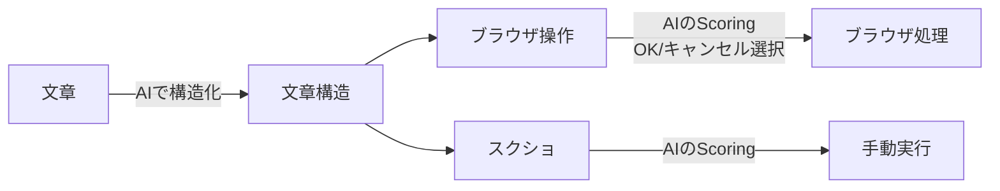

# 仕様構成

```mermaid
flowchart LR
    context["文章"]
    context_obj["文章構造"]
    context-->|AIで構造化|context_obj

    browser_operation["ブラウザ操作"]
    browser_run["ブラウザ処理"] 
    context_obj-->browser_operation
    browser_operation-->|AIのScoring\nOK/キャンセル選択|browser_run

    screen_shot["スクショ"]
    run["手動実行"]
    context_obj-->screen_shot
    screen_shot-->|AIのScoring|run
```

## 構造化

1. 文章をステップ事に分ける
2. ブラウザ操作を抽出

